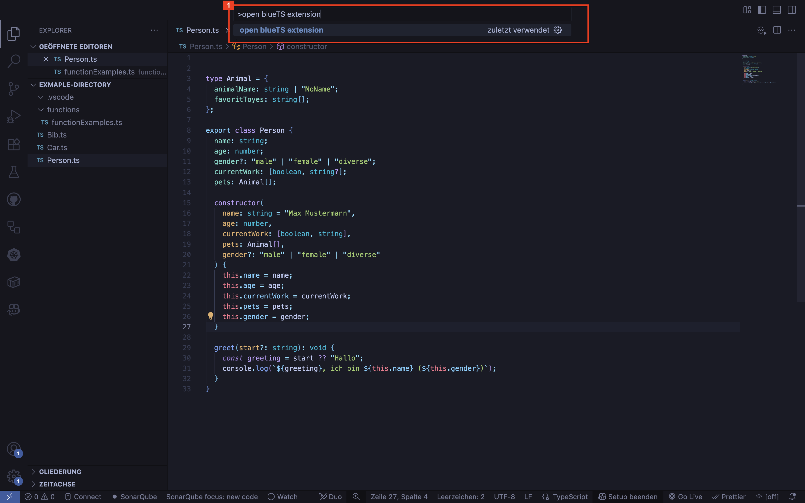

# blueTS

**VSCode-Extension zur Bereitstellung einer GUI zum direkten Aufruf von in TypeScript geschriebenen Funktionen oder Methoden ähnlich BlueJ**

## Features

- **Direkte Code-Ausführung**: TypeScript-Dateien mit einem Klick ausführen
- **Interaktive UI für Funktionsaufrufe**: Generiert automatisch Formulare für TypeScript-Funktionen mit allen Eingabe-Parametern
- **Intelligente Type-Validierung**: Unterstützt primitive Typen, Enums, Klassen, Generics (Map, Set, Promise, Record), Arrays, Tuples, Union-Types, Intersection-Types und verschachtelte Objekte
- **Klassen-Instanzen Management**: Erstelle und verwalte Klasseninstanzen direkt in der UI
- **Methoden-Aufruf Interface**: Rufe Methoden auf erstellten Instanzen über generierte Formulare auf

## Requirements

- Visual Studio Code Version 1.60.0 oder höher
- Node.js Version 22 oder höher

## Installation

1. Lade Sie die `.vsix` Datei herunter
2. Öffnen Sie Visual Studio Code
3. Gehe Sie zu Extensions (Cmd+Shift+X / Ctrl+Shift+X)
4. Klicke Sie auf "..." → "Install from VSIX..."
5. Wähle Sie die heruntergeladene `.vsix` Datei

## Öffnen

Es gibt zwei Möglichkeiten, die blueTS Extension zu öffnen:

### 1. Über das Sidebar-Icon (Empfohlen)

Klicken Sie auf das blueTS-Icon in der Sidebar, um die GUI zu öffnen.


**Voraussetzung:** Ihr Workspace muss mindestens eine TypeScript-Datei mit analysierbaren Konstrukten (Klassen oder Funktionen) enthalten.

### 2. Über die Befehlspalette

Öffnen Sie die Befehlspalette (`Cmd+Shift+P` oder `Strg+Shift+P`) und suchen Sie nach "open blueTS extension".



**Voraussetzung:** Keine - diese Methode funktioniert in jedem Workspace.

## Benutztung

1. Öffnen Sie eine TypeScript-Datei
2. Die Extension analysiert automatisch alle exportierten Funktionen und Klassen
3. Nutzen Sie die generierte UI um:
   - Funktionen mit Parametern aufzurufen
   - Klassen-Instanzen zu erstellen
   - Methoden auf Instanzen auszuführen

### Beispiel

```typescript
export function sum(a: number, b: number): number {
  return a + b;
}

export class Calculator {
  constructor(private initialValue: number) {}

  add(value: number): number {
    return this.initialValue + value;
  }
}
```

Die Extension generiert automatisch UI-Formulare für beide - `sum` und `Calculator`.

## Unterstützte Typen

- **Primitive**: string, number, boolean, bigint, symbol
- **Special**: null, undefined, void, never
- **Complex**: Array, Set, Map, Record, Promise, Enums, Classes, Interfaces (als Objects), Union Types, Intersection Types, Tuples

## Release Notes

### 0.0.1

Initial release von blueTS:

- Grundlegende Funktion zum Ausführen von TypeScript-Code
- UI-Generierung für Funktionsparameter
- Klassen-Instanzen Management
- Type-Validierung für primitive und komplexe Typen

---

**Entwickelt von Bennet Worrmann**
